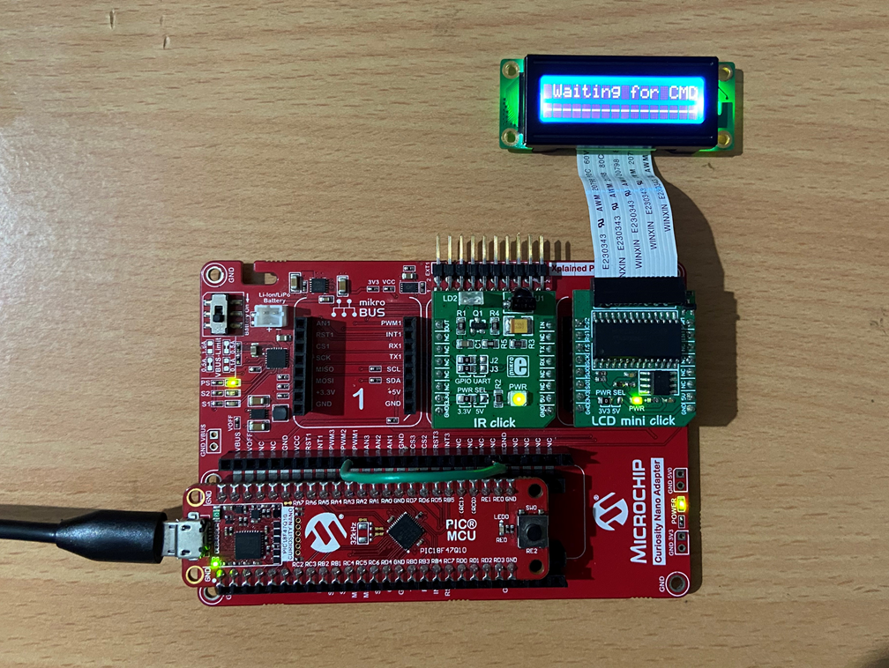
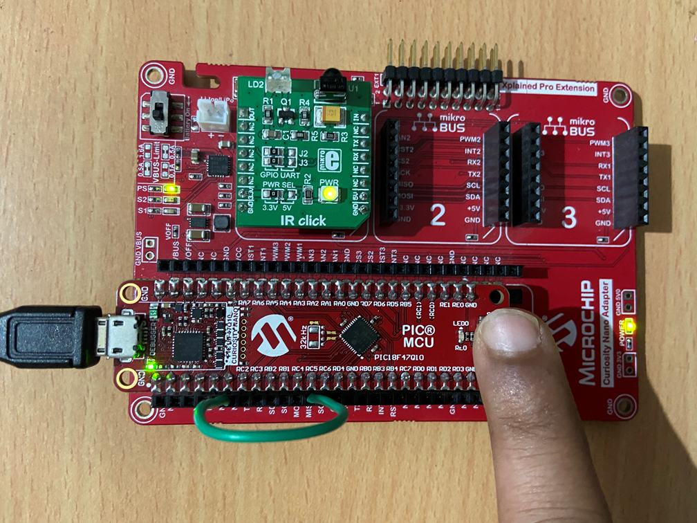

<!-- Please do not change this html logo with link -->

## IR Communication Using Core Independent Peripherals: IR Receiver

## Introduction
  
Many real-time control applications use infrared (commonly referred to as IR) wireless technology as a mode of communication. IR communication has the advantages of low-power consumption and reasonable cost. It is widely used in various control applications that involve the transmission of information and commands to operate different household appliances. Some commonly used home appliances that utilize IR communication include remote controls for televisions, air conditioners, and more. There are several standard IR protocols in use, such as S-link, RECS-80, RC-5, RC-6, and NEC. However, the most commonly used protocol is the NEC IR protocol.

### To see the IR Communication transmitter and receiver demo operation video, click the below image.

 

## Related Documentation

- [PIC18F47Q10 Product Page](https://www.microchip.com/wwwproducts/en/PIC18F47Q10 "PIC18F47Q10 Product Page")
- [PIC18F47Q10 Code Examples on GitHub](https://github.com/microchip-pic-avr-examples?q=PIC18F47Q10&type=&language= "PIC18F47Q10 Code Examples on GitHub")
- [IR Communication Using Core Independent peripherals: IR Transmitter— MPLAB® Discover link](https://mplab-discover.microchip.com/v2/item/com.microchip.code.examples/com.microchip.ide.project/com.microchip.subcategories.modules-and-peripherals.display.lcd/com.microchip.mcu8.mplabx.project.pic18f47q10-clc-ir-communication-receiver-mplab/1.0.3?view=about&dsl=IR+AND+Receiver)
- [AN2933 — DC Motor Control With Touch Interface and IR Communication](http://ww1.microchip.com/downloads/en/AppNotes/AN2933-DC-Motor-Control-with-Touch-Interface-and-IR00002933A.pdf "DC Motor control with Touch Interface and IR communication-Application note")

## Software  Tools

* [MPLAB® X IDE](https://www.microchip.com/mplab/mplab-x-ide) v6.25.0 or newer
* [XC8 Compiler](https://www.microchip.com/mplab/compilers) v3.00.0 or newer
* [Microchip PIC18F-Q Series Device Support Pack](https://packs.download.microchip.com) v1.28.451 or newer
* [Microchip Code Configurator](https://www.microchip.com/mplab/mplab-code-configurator) v5.6.2 or newer
* CCP Driver v4.1.1
* CLC Driver v4.4.0
* MSSP Driver v7.0.3
* PWM Driver v4.2.12
* TMR1 Driver v5.2.0
* TMR2 Driver v5.1.1
* SPI Host Driver v1.2.1

<b>Note:</b> To run the demo, the installed tool versions should be the same as, or later than, the specified versions. This example has not been tested with earlier versions.

## Hardware Used

* [PIC18F47Q10 Curiosity Nano](https://www.microchip.com/Developmenttools/ProductDetails/DM182029)
* [Curiosity Nano Base for Click boards](https://www.microchip.com/developmenttools/ProductDetails/AC164162)
* [IR click](https://www.mikroe.com/ir-click)

## Setup

## IR Receiver

The IR receiver unit is implemented using existing evaluation boards: the Curiosity Nano Base for click boards and the IR Click board. The TSOP38338 IR receiver module on the IR Click board is used to detect received IR commands. Figure 1 shows how to implement the IR receiver.

  
   <b>Figure 1.</b> IR Receiver  

 

The output of the IR Click boardTM, which is the demodulated data, is connected to a microcontroller (MCU) port pin. Whenever the first falling edge is detected on this port pin, the Hardware Limit Timer (HLT) module (Timer2 in this case), configured in Monostable mode, starts automatically. The timer will overflow after a few milliseconds, as determined by the period configuration. Upon a timer overflow interrupt, it is confirmed whether the data line is still low, ensuring that the detected falling edge was not caused by electrical noise.

The Capture/Compare/PWM (CCP) peripheral is used to capture the timings of the incoming data frame. The CCP can be used with either port B or port C of the MCU, but the demodulated data from the IR Click board is connected to port pin RA1. Therefore, the Configurable Logic Cell (CLC) is used as a buffer or interconnecting element to internally connect port pin RA1 to port pin RC0. RC0 is then used as the input to the CCP.

After the first valid falling edge is detected, the CCP with falling edge interrupt is enabled, and Timer 2 is disabled. The CCP is used along with Timer1 to detect the start sequence. After start detection, the captured values for the next 32 bits are stored in a buffer. While receiving data, the transaction is aborted if at any time the captured value goes out of range, and the registers, variables, and peripherals are reinitialized for the next valid IR frame detection.

If all the bits and edges are received correctly, Timer 1 is stopped, the CCP is disabled, and Timer 2 is enabled for the next IR frame detection. The command is then decoded from the CCP capture buffer. The received data is checked for the correct receiver address, the inverse of the address, the 8-bit command, and its inverse. If the address and its inverse, as well as the command and its inverse, match, the command data is reversed, since the Least Significant bit (LSb) of the command byte is transmitted first according to the NEC IR transmission protocol. The corresponding control action is then taken for the received command.

### Configuration Settings

* Insert the IR Click board into mikroBUS™ slot 2 of the Curiosity Nano Base for Click boards
* Insert the LCD mini Click board into mikroBUS™ slot 3 of the Curiosity Nano Base for click boards
* The MCU port pins used in the application are described in the table below

|Sr.No| MCU Port Pin #|Signal Name|Signal Description|IN/OUT|  
|:---------:|:----------:|:----------:|:----------:|:----------:|
| 1 | RA1 | IR_RX | IR received signal | IN |
| 2 | RC0 | CCP1  | Capture input      | IN |
| 3 | RA2 | LCD_CS2 | LCD mini chip select 2 | OUT |
| 4 | RD7 | LCD_CS | LCD mini chip select | OUT |
| 5 | RD5 | LCD_Reset | LCD mini reset | OUT |
| 6 | RD1 | LCD_PWM | LCD mini PWM | OUT |
| 7 | RC2 | PWM | CCP2 PWM | OUT |
| 8 | RC6 | SCK | SPI SCK for LCD | OUT |
| 9 | RC5 | SDI | SPI SDI for LCD | IN  |
| 10 | RC4 | SDO | SPI SDO for LCD | OUT |
| 11 | RE0 | LED | LED on PIC18F47Q10 Curiosity Nano board| OUT |
 

**Notes:**
1. RC0 is configured as the CCP capture input pin. This is because only PORT B or PORT C can be used as CCP input. The IR Click board can feed received data only to pin RA1, so RC0 is connected to RA1 internally using the CLC as an interconnecting element.
2. The CCP2 peripheral is configured as PWM, and PORT C can be used as the CCP2 output pin. RC2 is configured as the CCP PWM output pin. According to the LCD mini Click schematic, the PWM signal for LCD brightness control should be available on port pin RD1. Therefore, RC2 is connected to RD1 internally using the CLC as an interconnecting element.
3. The output of the PWM3 peripheral is available on the RA3 pin. To control the RE0 LED brightness using PWM3, short the RA3 pin to RE0.
4. After making the above hardware connections, power on the board using a Micro-USB cable. Build the demo firmware and load the generated hex file to the PIC18F47Q10 MCU.

  
   <b>Figure 2.</b> Demo Setup IR Receiver  

 

## Microcontroller Peripheral Configuration

| Peripherals| Configuration                         | Usage                                                                                                                                                                                                                                                                                                                                        
|-----------|----------------------------------------|-----------|
|Clock Control |Clock source: HFINTOSC HF Internal Clock: 32 MHz Clock Divider: 1  Active Clock Tuning Update: Enabled | System clock                                                                                                                
|CLC1|Enable CLC: Enabled   Logic Cell Mode bits: 4-input AND   | Provides programmable logic|                                                              
|CLC3|Enable CLC: Enabled Logic Cell Mode bits: 4-input AND Select CCP2_OUT as one of the inputs| Provides programmable logic
|CCP1| CCP Mode: Capture  Select Timer: Timer1  Input Signal: CCP1 pin   Mode: Falling Edge  CCP Interrupt Enable: Enabled |Used to time and control different events|
|CCP2|Enable CCP  CCP Mode: PWM  Select Timer: Timer4  Duty Cycle: 50% |Used to time and control different events|																																																									
|PWM| PWM Enable: Enabled   Select a Timer: TMR4  PWM Polarity: active_lo  | Used to generate Pulse-Width Modulation (PWM) signals|
|SPI| Clock Source: Fosc/4_SSPxADD Requested Speed (kHz): 100  Mode: Mode 0  Data Input Sample At: Middle | Used to transmit/receive data and communicate|
|TMR1| Clock Source: Fosc/4   Clock Prescaler: 1:2   Timer Count Editor Enable: Enabled   Requested Period: 2 ms   | Used for configuring time-out|
|TMR2|Timer Enable: Enabled   Control Mode: Roll over pulse   Clock Source: LFINTOSC   Clock Frequency: 31 kHz   Clock Prescaler: 1:1   Requested Period: 2 ms   TMR Interrupt Enable: Enabled  | Used for configuring time-out|
|TMR4|Timer Enable: Enabled   Control Mode: Roll over pulse   Clock Source: Fosc/4   Clock Frequency: 8 MHz   Clock Prescaler: 1:64   Requested Period: 2 ms   | Used for configuring time-out|

## Demo Operation

### IR Transmitter

* Switch S1 is used to send IR commands to the IR receiver
* Pressing switch S1 will send an IR command equal to the switch press count plus 0x80 (i.e., from 0x81 to 0x88). After the eighth press, the commands from 0x81 to 0x88 are repeated.

### IR Receiver

* After reset, the IR receiver will wait for a command to be received, and the message "Waiting for CMD" will be displayed on the LCD
* If any command is received from the IR transmitter board, the corresponding control action is taken, and the received command along with the control action is displayed on the LCD screen
* If there is any error during reception—such as an error in the start of the frame, an error in data bit length, a receiver address mismatch, or an error in the command byte—a corresponding error message will be displayed on the LCD, and the receiver will be ready for the next IR frame reception
* Press Switch S1 to Send Command #81 to the receiver, as shown in Figure 3

  
   <b>Figure 3.</b> Press Switch S1 to Send Command #81  

 

* Receiver after receiving command #81:

  
   <b>Figure 4.</b> Receiver After Receiving Command #81  

 

* Below is the list of all commands and control actions.

1. Command #81: make brightness of LED 25%.
2. Command #82: make brightness of LED 50%.
3. Command #83: make brightness of LED 75%.
4. Command #84: make brightness of LED 100%.
5. Command #85: make brightness of LED 75%.
6. Command #86: make brightness of LED 50%.
7. Command #87: make brightness of LED 25%.
8. Command #88: make brightness of LED 0%.

## Conclusion

This demo example demonstrates the use of important features of PIC18-Q10 MCUs for simple real-time control applications. It provides an overview of IR communication using the NEC infrared transmission protocol. The IR transmitter is implemented using Core Independent Peripherals (CIPs) of the PIC18-Q10 microcontroller, such as CLC, PWM and and DSM peripherals, with minimal CPU intervention. The IR receiver is implemented using Timer2, CCP and Timer1 peripherals of the PIC18-Q10 microcontroller.
The combination of PWM, CCP, CLCs, DSM, and other core independent peripherals, along with generic peripherals such as timers and HLTs available in PIC18-Q10 MCUs, offers lower system cost, low-power consumption, facilitating reliable, deterministic and safe application development. These microcontrollers can be used for a wide range of general-purpose, low-power, and reliable real-time control applications, such as remote control of various home appliances and remote-controlled toys for children.

