<!-- Please do not change this html logo with link -->

## IR communication using Core Independent Peripherals: IR Receiver

## Introduction
  
Many real time control applications use infrared (commonly referred to as IR) wireless technology, as a communication mode. IR communication has the merits of consuming low power and it is available at a very reasonable cost. IR communication is used in numerous control applications involving transmission of information and commands to control different house-hold appliances. Some commonly used home appliances which involve IR communication are the remote controls for television and air conditioners etc. There are various standard IR protocols in use such as S-link, RECS-80, RC-5, RC-6 and NEC. But the most commonly used protocol is NEC IR protocol.

### To see the IR Communication transmitter and receiver demo operation video, click on the below image.

 <a href="https://youtu.be/kxnTy4JSeoI" rel="nofollow">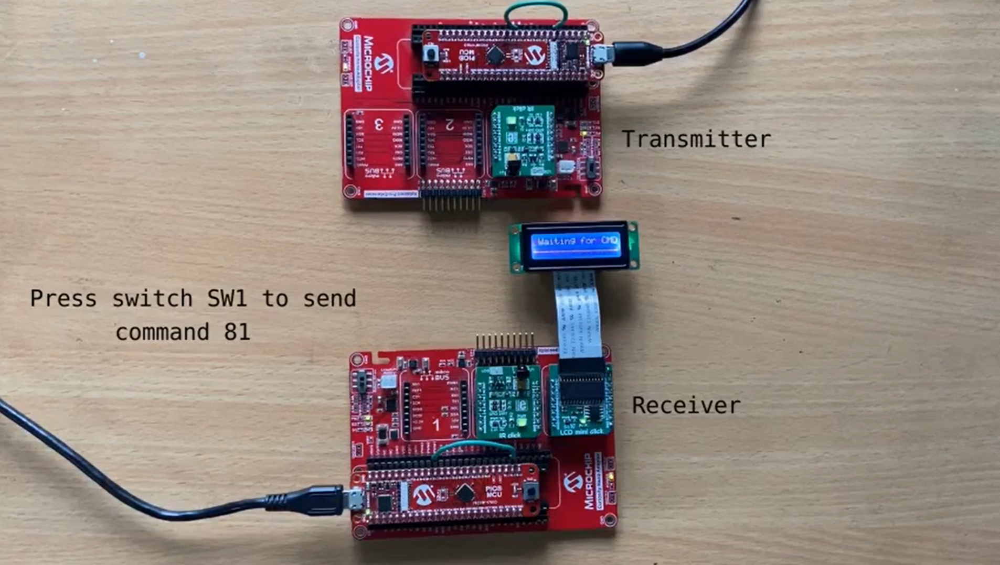</a>

## Useful Links

- [PIC18F47Q10 Product Page](https://www.microchip.com/wwwproducts/en/PIC18F47Q10 "PIC18F47Q10 Product Page")
- [PIC18F47Q10 Code Examples on GitHub](https://github.com/microchip-pic-avr-examples?q=PIC18F47Q10&type=&language= "PIC18F47Q10 Code Examples on GitHub")
- [IR Communication using Core Independent peripherals:IR Transmitter-GitHub link](https://github.com/microchip-pic-avr-examples/pic18f47q10-clc-ir-communication-transmitter-mplab.git "IR Communication using Core Independent peripherals:IR Transmitter-GitHub link")
- [DC Motor control with Touch Interface and IR communication-Application note](http://ww1.microchip.com/downloads/en/AppNotes/AN2933-DC-Motor-Control-with-Touch-Interface-and-IR00002933A.pdf "DC Motor control with Touch Interface and IR communication-Application note")

## IR Receiver

The IR receiver unit is realized using the existing evaluation boards; Curiosity Nano Base for click boards and IR Click board. TSOP38338 IR receiver module on IR click board is used for detecting received IR commands. IR receiver is implemented as shown in the figure 1.

  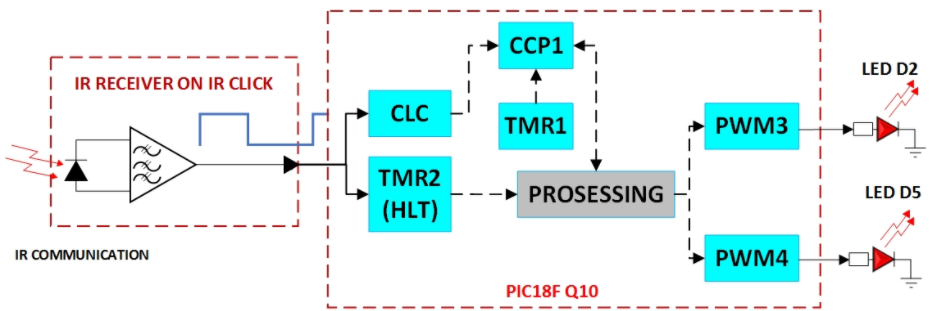
   Figure 1: IR Receiver  

 

Output of the IR click, the demodulated data is connected to the microcontroller(MCU) port pin. Whenever the first falling edge is detected on the port pin, the HLT (Timer 2) module configured in monostable mode will start automatically. Timer will overflow after few ms as per period configuration. Upon timer overflow interrupt it is confirmed whether the data line is still low, and the detected falling edge is not due to electrical noise. The capture and compare peripheral (CCP) is used to capture timings of the incoming data frame. The CCP can be used with either port B or port C of the MCU and the demodulated data from IR click is connected to port pin RA1. So CLC is used as buffer or an interconnecting element to connect port pin RA1 internally to port pin RC0. RC0 is used as input to the CCP. After the first valid falling edge is detected, the CCP with falling edge interrupt is enabled and Timer 2 is disabled. The CCP along with Timer 1 is used for detecting start sequence. After start detection the captured values for the next 32 bits are stored in a buffer. While receiving data, anytime if the captured value goes out of range the transaction is aborted and registers, variables and peripherals are re-initialized for the next valid IR frame detection. If all the bits/edges are received properly, Timer 1 is stopped, CCP is disabled and Timer 2 is enabled for the next IR frame detection. The command is decoded from CCP capture buffer. Received data is checked for correct receiver address, inverse of address, 8-bit command and its inverse. If the address and inverse of address, command and inverse of command are matching then the command data is reversed as the LSB of command byte is transmitted first according to the NEC IR transmission protocol. Corresponding control action is taken for the command received.

## Software  Tools

- [MPLAB X IDE v5.40](https://www.microchip.com/mplab/mplab-x-ide "MPLAB X IDE v5.40")
- [XC8 Compiler v2.30](https://www.microchip.com/mplab/compilers "XC8 Compiler v2.20")
- [MPLAB Code Configurator v4.0.2](https://www.microchip.com/mplab/mplab-code-configurator "MPLAB Code Configurator v4.0.2")
- [PIC18F-Q_DFP v1.8.154](https://packs.download.microchip.com/ "PIC18F-Q_DFP v1.8.154")

***Note: For running the demo, the installed tool versions should be the same or later. This example is not tested with the previous versions.***

## Hardware used

- [PIC18F47Q10 Curiosity Nano](https://www.microchip.com/Developmenttools/ProductDetails/DM182029 "PIC18F47Q10 Curiosity Nano")
- [Curiosity Nano Base for Click boards](https://www.microchip.com/developmenttools/ProductDetails/AC164162 "Curiosity Nano Base for Click boards")
- [IR click]( https://www.mikroe.com/ir-click "IR click")

## MCC settings

This section shows the settings used for the system clock and the peripheral configurations in the demo example. These settings were done using the MPLAB Code Configurator (MCC). Open MCC to look at the settings of the modules.

## MCC settings for IR  Receiver:

In the IR receiver demo firmware the High-Frequency Internal Oscillator (HFINTOSC) is configured to generate 32MHz clock and is used as a system clock.Refer figure 2.

  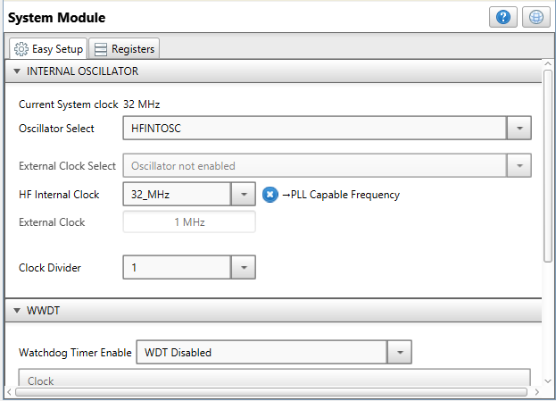
   Figure 2: System Clock Configuration  

 

The demodulated data from IR Click is fed to the microcontroller port pin. The HLT (Timer2) module, configured in monostable mode starts automatically, whenever the first falling edge is detected on the port pin. Timer will overflow after 2 ms as per period configuration. Upon timer overflow interrupt it is confirmed whether the data line is still low, and the detected falling edge is not due to electrical noise. The Timer 2 configuration to ignore electrical noise is shown in the figure 3.

  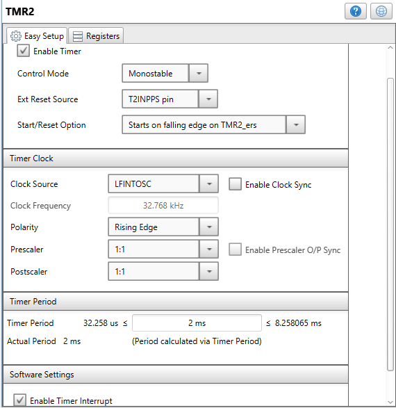
   Figure 3: Timer 2 configuration to ignore electrical noise  

 

The CCP1 module along with Timer 1 is used for capturing the commands received by IR Receiver. The CCP1 and Timer 1 modules configuration is shown in the figures 4 and 5.

  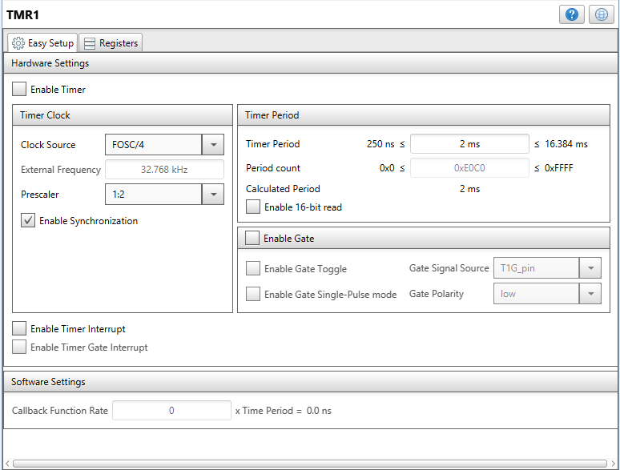
   Figure 4: Timer 1 configuration for RX  

 

  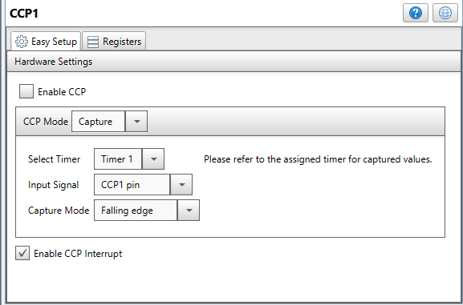
   Figure 5: CCP1 Configuration  

 

The CCP module can be used with either port B or port C of the microcontroller and the demodulated data from the IR click is fed to port pin RA1. So CLC is used as buffer or an interconnecting element to connect port pin RA1 internally to port pin RC0. RC0 is used as input to the CCP module. The CLC configuration as interconnecting element is shown in the figure 6.

  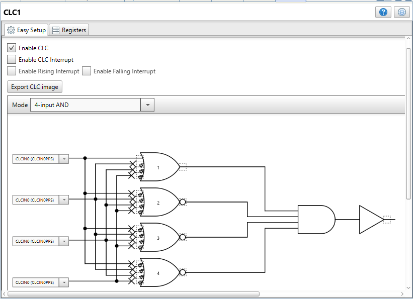
   Figure 6: CLC configuration as interconnecting element  

 

For using LCD mini click MCC provides library with pre-configured SPI module along with ready to use functions Select the appropriate MSSP module under SPI column. Refer figure 7.

  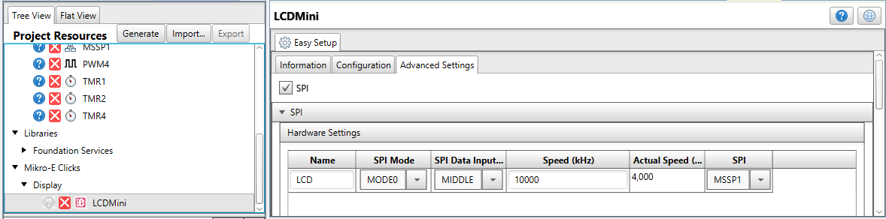
   Figure 7: MCC Micro-E Click Library for LCD mini click  

 

Set the SPI speed under MSSP foundation service library configurations section.Refer figure 8.

  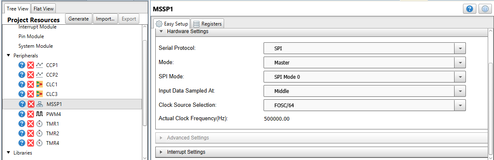
   Figure 8: SPI Speed Configuration in MSSP  

 

## Hardware setup

##  IR Receiver

* Connect IR Click board in mikroBUS™ slot 2 of the Curiosity Nano Base for click boards.
* Connect LCD mini Click board in mikroBUS™ slot 3 of the Curiosity Nano Base for click boards.
* MCU port pins used in the application are discribed in the below table.

|Sr.No| MCU Port pin #|Signal Name|Signal Description|IN/OUT|  
|:---------:|:----------:|:----------:|:----------:|:----------:|
| 1 | RA1 | IR_RX | IR received signal | IN |
| 2 | RC0 | CCP1  | Capture input      | IN |
| 3 | RA2 | LCD_CS2 | LCD mini chip select 2 | OUT |
| 4 | RD7 | LCD_CS | LCD mini chip select | OUT |
| 5 | RD5 | LCD_Reset | LCD mini reset | OUT |
| 6 | RD1 | LCD_PWM | LCD mini PWM | OUT |
| 7 | RC2 | PWM | CCP2 PWM | OUT |
| 8 | RC6 | SCK | SPI SCK for LCD | OUT |
| 9 | RC5 | SDI | SPI SDI for LCD | IN  |
| 10 | RC4 | SDO | SPI SDO for LCD | OUT |
 

**Note:**

1. RC0 is configured as CCP capture input pin. This is due to the reason that PORT B or PORT C can only be used as CCP input. IR click board can feed received data only to pin RA1.So connected RC0 to RA1 internally using CLC as interconnecting element
2. The CCP2 peripheral is configured as PWM and PORT C can be used as CCP2 output pin. RC2 is configured as CCP PWM output pin. As per the LCD mini click schematic, PWM signal for LCD brightness control should be available on PORT pin RD1. Hence, connected RC2 to RD1 internally using CLC as interconnecting element.

  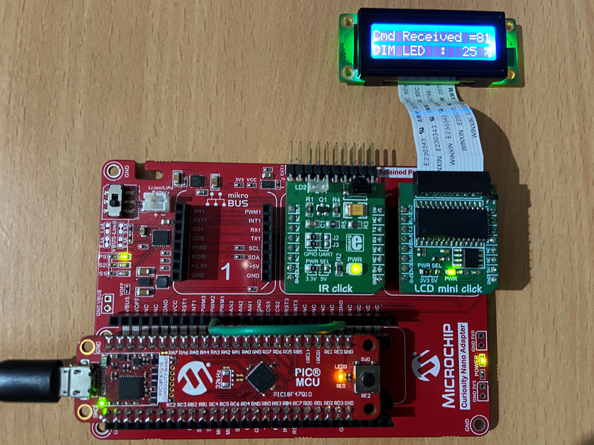
   Figure 9: Demo setup IR Receiver  

 

* After making the above hardware connections, power on the board with micro USB cable. Build demo firmware and load the generated hex file to the PIC18F47Q10 MCU.

## Demo operation

## IR Transmitter

* Switches S1 is used to send IR commands to the IR receiver.
* Pressing switch S1 will send the IR command equal to the switch press count plus 0x80 i.e. from 0x81 to 0x88. After 8th count the command 0x81 to 0x88 are repeated. 

## IR Receiver

* After reset the IR receiver will wait for command to be received and "Waiting for CMD" message will be displayed on the LCD.

* If any command is received from the IR Transmitter board then corresponding control action is taken and the received command along with control action is displyed on the LCD screen.

* If there is any error during reception such as error in start of the frame, error in data bit length, receiver address mismatch, error in command byte etc. then corrosponding error message will be displayed on the LCD and the receiver will get ready for next IR frame reception.

* Press switch S1 to send command #81 to the receiver as shown in figure 10.

  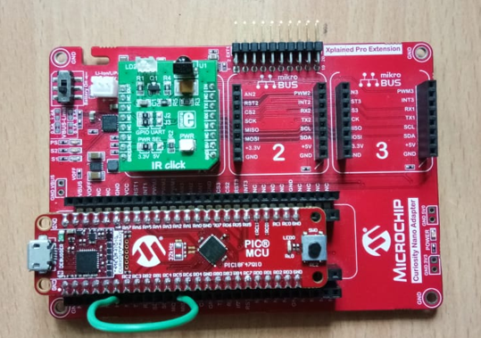
   Figure 10: Press switch S1 to send command #81  

 

* Receiver after receiving command #81:

  
   Figure 11: Receiver after receiving command #81  

 

* Below is the list of all commands and control actions.

1. Command #81: make brightness of LED 25%.
2. Command #82: make brightness of LED 50%
3. Command #83: make brightness of LED 75%.
4. Command #84: make brightness of LED 100%
5. Command #85: make brightness of LED 75%.
6. Command #86: make brightness of LED 50%
7. Command #87: make brightness of LED 25%.
8. Command #88: make brightness of LED 0%

## Conclusion

This demo example demonstrated the usage of important features of PIC18-Q10 MCUs for simple Real Time Control applications. This demo example illustrates an overview of IR communication with NEC infrared transmission protocol. The IR Transmitter is implemented using core independent peripherals (CIPs) of PIC18-Q10 microcontroller such as CLCs, PWM and DSM peripherals without much CPU intervention. The IR receiver is implemented using Timer 2, CCP and Timer1 peripherals of PIC18-Q10 microcontroller. The combination of PWM, CCP, CLCs and DSM etc. core independent peripherals along with other generic peripherals such as Timers and HLTs available in PIC18-Q10 MCUs offers the lower system cost, low power and reliable deterministic and safe application development. These microcontrollers can be used for a wide range of general purpose, low-power and reliable, deterministic real time control applications such as remote control of various home appliances and remote-controlled toys for kids etc.

